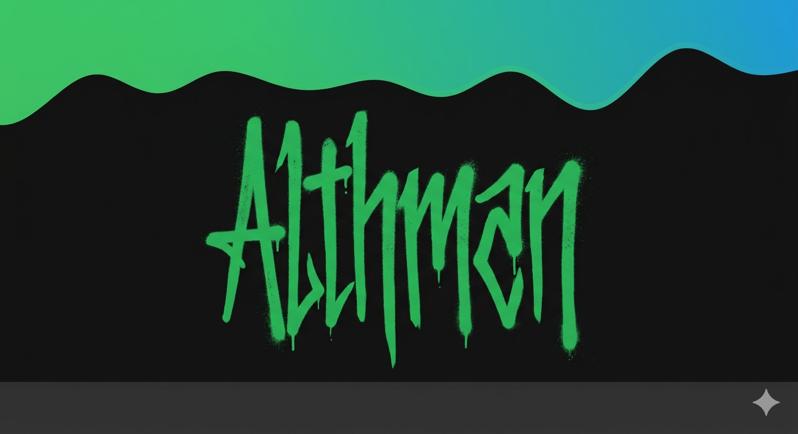

  

  # Olá, eu sou Henrique 👋
  
  <i>Desenvolvedor Full Stack | UI Designer | Apaixonado por Códigos</i>

    

  
  

---

### 🚀 Sobre Mim

Eu transformo café em interfaces elegantes e código limpo. Meu foco atual é a criação de aplicações **Single Page (SPA)** com estética moderna e o desenvolvimento de motores de jogos leves utilizando **HTML5 Canvas**.

- 💻 **Foco:** Interfaces estilo "Dark Mode" e Performance.
- 🕹️ **Hobby:** Criar mecânicas de jogos clássicos com JS Puro.

---

### 🛠️ Toolbox (Minhas Ferramentas)

  

---

### 📫 Vamos Conversar?

  
  &nbsp;&nbsp;
  

